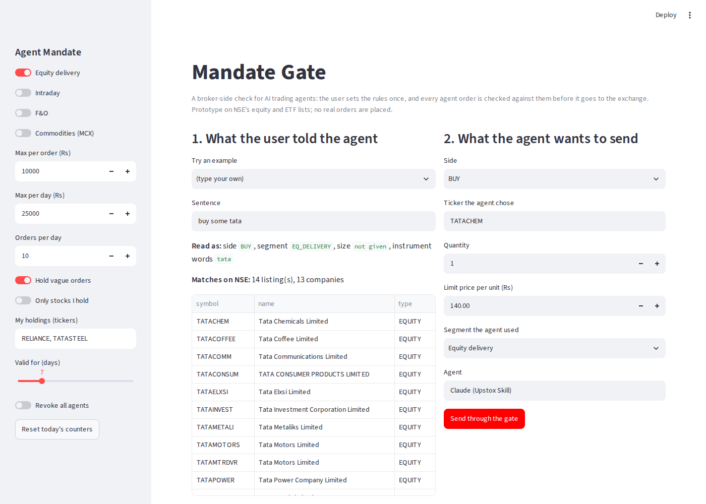

# Mandate Gate

A working prototype of **Agent Mandates**: a broker-side check for AI agents that trade on a user's behalf.

AI agents can now place real orders on Indian brokers from a plain sentence. The safety checks in today's agent skills run on the user's own machine, inside the skill. Mandate Gate sits on the broker's side instead. The user sets a few rules once (which segments, how much money, how many orders, for how long), and every agent order is checked against those rules before it goes to the exchange, whatever the agent does.

It also reads the user's original sentence independently of the agent, because people don't speak in tickers. On NSE's list of 1,946 companies:

- 31.5% of companies share their first word with another listed company
- "tata" matches 13 companies, and "reliance", "bajaj", "jindal" and "mahindra" match 8 each
- 15 ETFs track the Nifty 50, and 13 are gold ETFs

So when a user says "buy some tata", the gate holds the order and asks the user to pick, instead of trusting the agent's guess.

## What it decides

| Verdict | When |
|---|---|
| **ALLOW** | In scope, clearly specified, and under every limit |
| **HOLD** | Needs a tap in the app: the sentence matched several instruments, the agent chose a stock the sentence doesn't point to, the quantity was never given, an exit-all, or a large sell |
| **BLOCK** | Outside the mandate: wrong segment (for example F&O when only equity delivery is allowed), over the per-order or daily cap, too many orders today, not in holdings when holdings-only is on, or the mandate is expired or revoked |

Every decision produces an **Intent Receipt**: the sentence the user typed, how it was read, what the agent sent, the verdict and the reasons. Support can see why an order happened in seconds.

## Output of `python demo.py`

```
"buy some tata"  ->  HOLD
   - "tata" matches 13 companies, so the user should pick.
   - No quantity or amount in the sentence; the agent assumed 1.

"put 10k in gold"  ->  HOLD
   - "gold" matches 13 ETFs, so the user should pick.

"sell half my reliance"  ->  ALLOW
   - Within scope, clearly specified, and under every limit.
     ("reliance" alone matches 8 companies, but the user holds only one)

"hedge my portfolio with nifty puts"  ->  BLOCK
   - F&O is outside this mandate's scope.

"exit everything"  ->  HOLD
   - Exit-all is irreversible, so it needs a tap in the app.

--- 'keep buying tata steel if it drops 2% more' (agent loops, 40 shares at Rs 140) ---
   orders 1 to 4: ALLOW
   order 5: BLOCK  (This order would take today's agent buying past the Rs 25,000 daily cap.)
```



## Run it

```bash
pip install -r requirements.txt
python demo.py              # the case-study scenarios
python ambiguity_stats.py   # reproduces the numbers above
python -m pytest -q         # 33 tests
streamlit run app.py        # interactive demo: set a mandate, type a sentence, send an order through the gate
```

## How it works

- `mandate_gate/parser.py` reads the sentence: side (buy, sell, exit all), segment (options words like "puts", "lots" or "strike" mean F&O, and "put 10k in gold" is not an option), size (quantity, rupee amount such as "10k" or "1.5 lakh", or a fraction such as "half"), and the words that name the instrument.
- `mandate_gate/instruments.py` matches those words against NSE's equity and ETF lists. Tickers count only when typed in capitals, an exact company name beats longer names ("tata steel" is not Tata Steel Long Products), and index ETFs match on what they track.
- `mandate_gate/gate.py` applies the mandate in a fixed order (live mandate, segment, irreversible actions, instrument, size, universe, money and count limits), keeps today's counters, and writes the receipt.

## Limits, stated honestly

- The instrument list is a public NSE snapshot from November 2023, so some listings have changed since. In production this would use the broker's live instrument master.
- The parser is rule-based and English-only. It is built to be conservative: when it is unsure, it holds.
- Prices come from the agent's proposed order. No market data is fetched and no real orders are placed.
- This is a product prototype written for a job application, not an Upstox product.

## Data

NSE equity and ETF lists (symbol and name only), taken from the public NSE `EQUITY_L.csv` and ETF list as collected in [bhavansh/isin-database](https://github.com/bhavansh/isin-database).

Built by Anisha Tiwary: [linkedin.com/in/anisha-tiwary-94b89030a](https://linkedin.com/in/anisha-tiwary-94b89030a)
